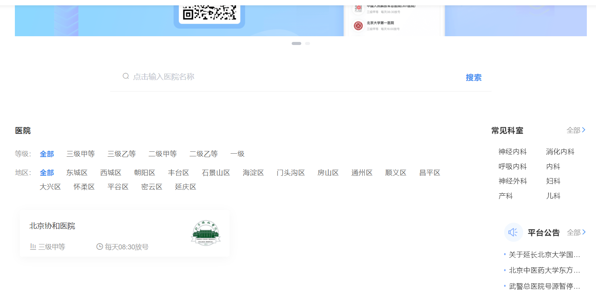
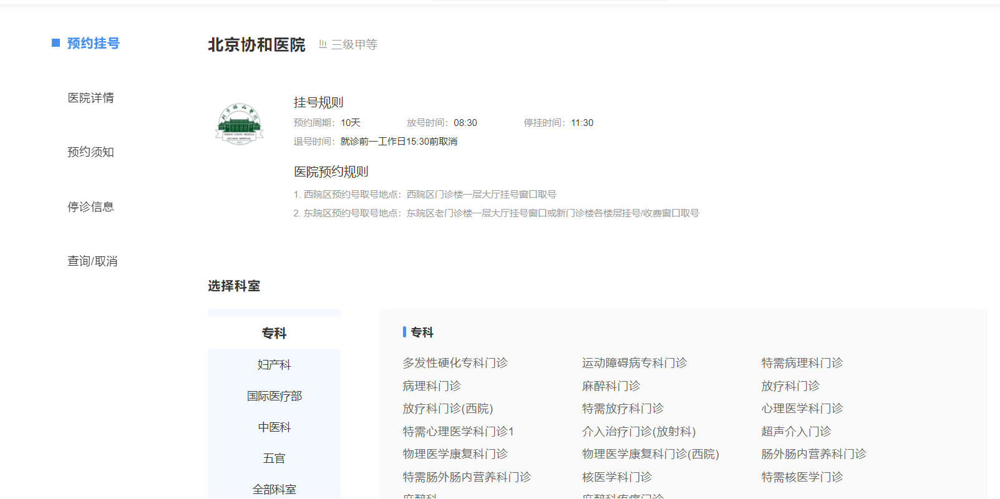
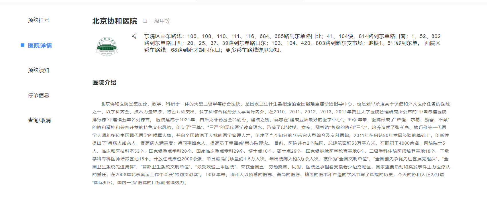
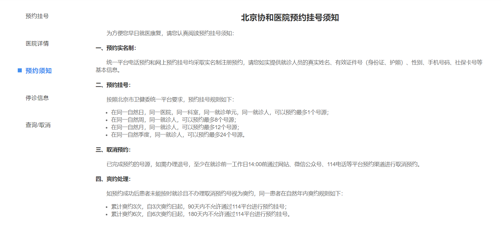
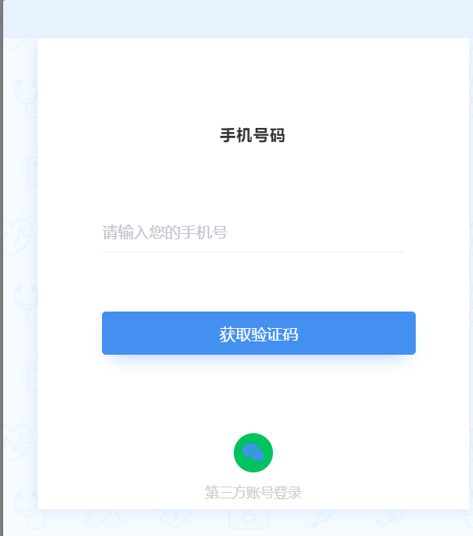
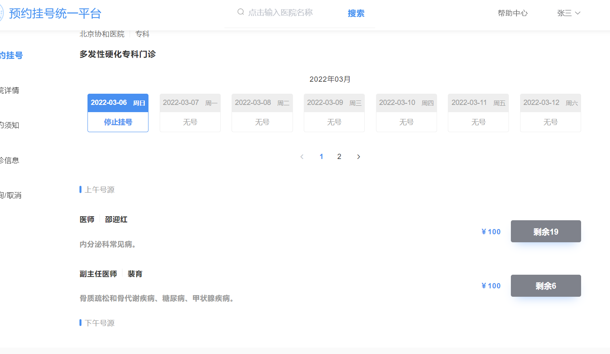
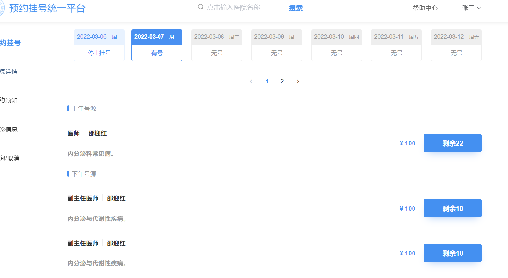

首页
=============
在首页中展示了医院的列表，可以通过搜索框去模糊查询医院，也可以通过医院等级或者地区去查询。

预约信息
=============
当你点击你锁选择的医院时，会展示医院预约挂号的规则，医院科室的列表，医院详情。

登录判断
=============
你可以直接点登录。当你点击你需要预约的科室时，会判断是否登录，已经登录则跳转到预约页面，否则跳转到登录页面。  
你可以通过手机短信验证来登录。（验证码固定为123456）  

预约挂号
=============
根据医生的排班时间和医院的预约周期，列出医院这个周期可预约的医生列表和剩余预约数量。选择可预约的医生即可生成挂号订单。

